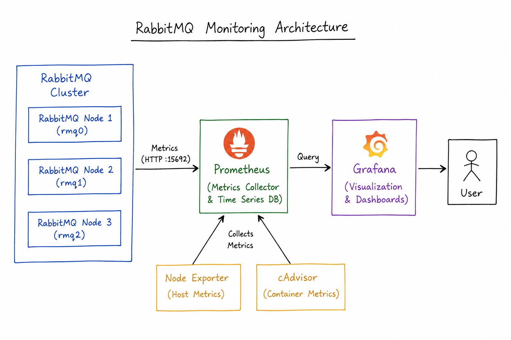

# RabbitMQ Monitoring with Prometheus and Grafana

A DevOps monitoring project demonstrating how to collect, store, and visualize RabbitMQ metrics using Prometheus and Grafana, deployed on AWS EC2 with Docker Compose.

Built as part of the **DevOps + SRE Daily Challenge Series**.

---

## Architecture



---

## Project Structure

```
rabbitmq-monitoring/
├── docker-compose-metrics.yml
├── docker-compose-overview.yml
├── README.md
├── architecture.png
└── screenshots/

```

---

## Stack

| Component | Role |
|---|---|
| RabbitMQ (x3) | Message broker exposing Prometheus metrics |
| Prometheus | Metrics scraping and time-series storage |
| Grafana | Dashboard visualization |
| Node Exporter | Host-level OS metrics (CPU, memory, disk) |
| cAdvisor | Container-level resource metrics |
| Docker Compose | Service orchestration |
| AWS EC2 (Ubuntu) | Compute |

---

## How to Run

### 1. Clone the Repository

```bash
git clone https://github.com/rabbitmq/rabbitmq-server.git
cd rabbitmq-server/deps/rabbitmq_prometheus/docker
```

### 2. Start the Monitoring Stack

```bash
docker compose -f docker-compose-metrics.yml up -d
```

### 3. Start the RabbitMQ Cluster

```bash
docker compose -f docker-compose-overview.yml up -d
```

### 4. Verify Running Containers

```bash
docker ps
```

Expected: RabbitMQ nodes (rmq0, rmq1, rmq2), Prometheus, Grafana, Node Exporter, cAdvisor.

---

## Access Services

| Service | URL | Credentials |
|---|---|---|
| Grafana | `http://<EC2_PUBLIC_IP>:3000` | admin / admin |
| Prometheus | `http://<EC2_PUBLIC_IP>:9090` | — |

---

## Validation

### Prometheus Targets

Navigate to `http://<EC2_PUBLIC_IP>:9090/targets` and confirm all three nodes show as UP:

```
rmq0 — UP
rmq1 — UP
rmq2 — UP
```

### Grafana Dashboard

Open Grafana and verify RabbitMQ metrics are populating:

- Ready messages and message rates
- Active publishers and consumers
- Connections and channels
- Queue depth and statistics
- Memory and disk usage per node

---

## Challenges and Learnings

**What was tricky:**
- Docker daemon permission issues on fresh EC2 instances
- Container networking and service discovery between Compose stacks
- Validating Prometheus scrape targets and fixing UP/DOWN states
- Resource pressure when running a 3-node cluster on a smaller EC2 instance

**What this project strengthened:**
- RabbitMQ cluster monitoring and metrics exposure
- Prometheus scraping, target configuration, and time-series storage
- Grafana dashboard setup and visualization
- Container observability with cAdvisor and Node Exporter
- Docker Compose multi-service deployments

---

## Screenshots

| Screenshot | Description |
|---|---|
| `prometheus-targets.png` | All three RabbitMQ nodes showing UP |
| `grafana-dashboard.png` | RabbitMQ monitoring dashboard |
| `docker-ps.png` | All monitoring containers running |

---

## Future Improvements

- [ ] Alerting via Alertmanager with email and Slack notifications
- [ ] Custom Grafana dashboards for specific queue workloads
- [ ] Long-term metric retention configuration
- [ ] Centralized logging integration
- [ ] Kubernetes deployment
- [ ] High-availability monitoring stack

---

## Author

**Manik Singhal**
